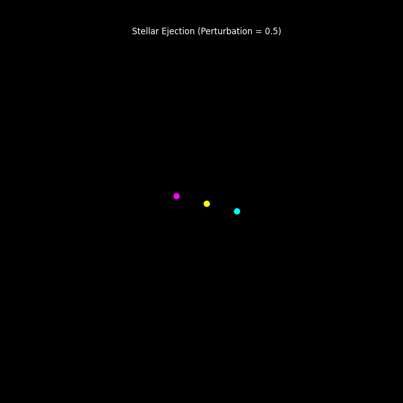
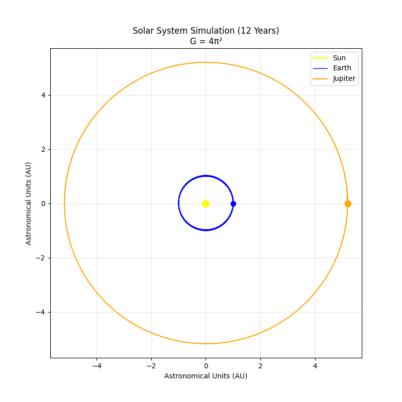

# 3-Body Laboratory: Symplectic Physics Engine

> **Abstract:** A high-precision computational study of gravitational interactions between three point-masses. Using a custom symplectic Velocity-Verlet integrator, this laboratory quantifies the transition from periodic stability to stochastic collapse, identifies critical perturbation thresholds ($\delta \approx 0.5$) for stellar ejection, and successfully models long-term real-world Keplerian mechanics.


*Figure 1: The Chenciner-Montgomery Figure-Eight orbit destabilizing under a momentum-balanced velocity perturbation ($\delta = 0.5$). The kinetic injection shatters the gravitational binding energy, resulting in total system collapse and a stellar ejection.*

## Mathematical Validation (Solar System Test)
To prove the long-term stability and accuracy of the integration engine, the system was tested against known Keplerian orbits using Astronomical Units and Solar Masses ($G = 4\pi^2$). 


*Figure 2: A 12-year simulation of the Sun, Earth, and Jupiter. The perfect closure of the concentric orbits proves zero numerical energy leakage in the custom Verlet integrator.*

## Core Architecture & Research Achievements
* **Integrator:** Custom Symplectic Velocity-Verlet (prevents energy drift over long timescales) vs. SciPy RK45.
* **Force Calculation:** Vectorized Newtonian Gravity utilizing NumPy broadcasting to bridge 2D physical coordinates and 1D state-space vectors. Includes Gravitational Softening ($\epsilon = 0.0001$) to prevent close-encounter singularities.
* **Hamiltonian Energy Audit:** Quantified the engine's physical precision, maintaining a relative energy error of $< 10^{-9}$ over extended baseline simulations.
* **Chaos Quantification:** Measured the Lyapunov divergence of periodic orbits, documenting exponential error growth from initial tiny perturbations.
* **Modular API:** Clean architectural separation between `src/physics.py` (derivatives), `src/integrators.py` (solvers), and `scripts/` (experiments).

## Historical Diagnostics


*Figure 3: The Baseline Chenciner-Montgomery Figure-Eight Orbit. This zero-angular-momentum solution serves as the control state for all subsequent chaotic perturbation experiments.*


*Figure 4: Energy Partitioning and Conservation. The top panel illustrates the perfect anti-correlation between Kinetic (T) and Potential (V) energy, while the bottom panel monitors the relative Hamiltonian error ($\Delta E/E_0$), maintained at $\sim 10^{-9}$[cite: 10, 12].*


*Figure 5: Integrator Benchmarking. While the adaptive RK45 solver (blue) exhibits a systematic "secular drift" in energy over time, the custom Velocity-Verlet engine (orange) maintains bounded energy error—proving its necessity for long-term physical consistency.*


*Figure 6: Quantitative Chaos. A tiny initial perturbation of $10^{-4}$ grows exponentially to $\approx 2 \times 10^{-2}$ over 60 time units, providing a clear Lyapunov signature of the system's sensitivity to initial conditions.*

## How to Run the Laboratory

### Prerequisites
* Python 3.10+
* NumPy, SciPy, Matplotlib

### Execution
Run the experiment scripts directly from the root directory to maintain relative imports.
```bash
# 1. Run the high-precision Figure-Eight orbit
python -m scripts.run_simulation

# 2. Compare the long-term energy stability of RK45 against the Velocity-Verlet engine
python -m scripts.compare_integrators

# 3. Quantify the "Butterfly Effect" (Lyapunov divergence)
python -m scripts.butterfly_effect

# 4. Sweep for the exact stellar ejection velocity threshold
python -m scripts.run_sensitivity_sweep

# 5. Generate the cinematic system collapse animation (GIF)
python -m scripts.animate_collapse

# 6. Validate the engine with a 12-year Solar System simulation
python -m scripts.simulate_solar_system