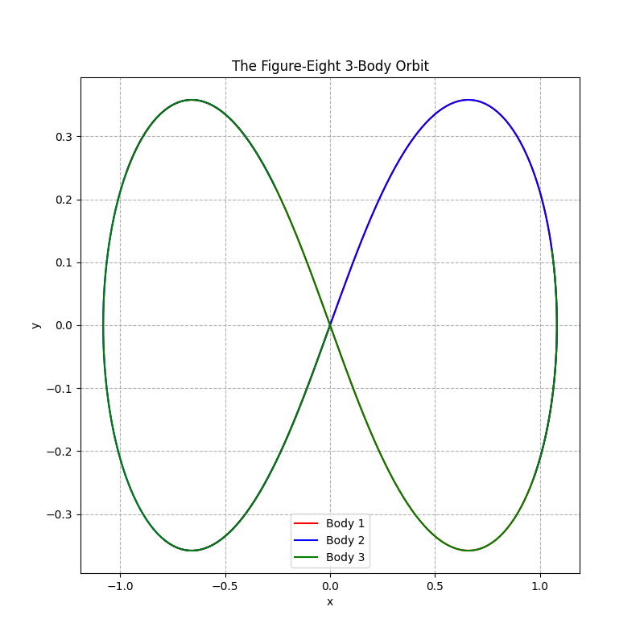
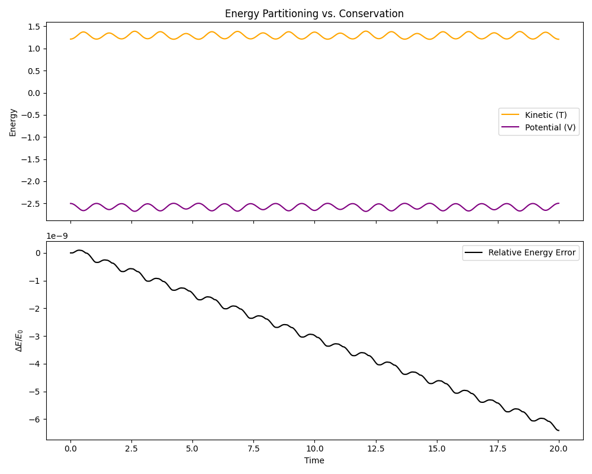
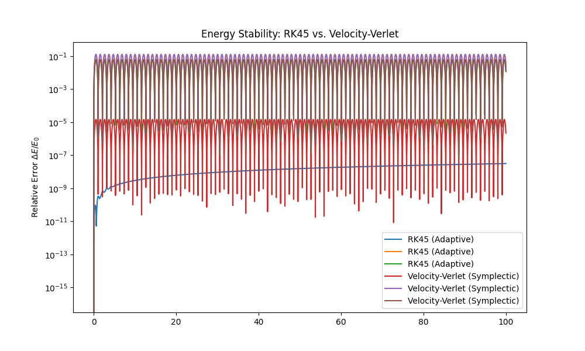
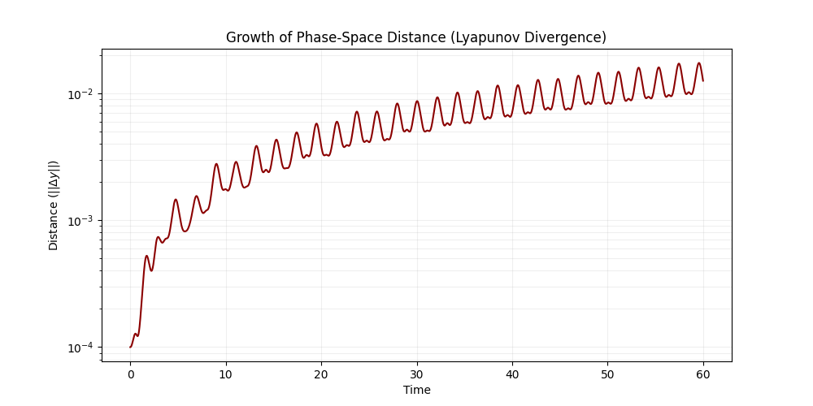

# Chaotic 3-Body Dynamics: Orbital Stability

A high-precision computational study of gravitational interactions between three point-masses, exploring the boundary between periodic stability and chaotic divergence.


*Figure 1: Successful verification of the Chenciner-Montgomery periodic solution. This result confirms the accuracy of the force calculation logic and the stability of the numerical integrator.*


*Figure 2: Energy audit over $t=20$. Relative Hamiltonian error ($\Delta E/E_0$) is maintained at $\sim 10^{-9}$, verifying the physical validity of the simulation.*


*Figure 3: Energy Stability Showdown. While the adaptive RK45 solver (blue) exhibits a systematic "secular drift" in energy, the custom Velocity-Verlet engine (red/brown) maintains bounded energy error—proving its superiority for long-term physical consistency.*


*Figure 4: Quantitative Chaos. A tiny initial perturbation of $10^{-4}$ grows exponentially to $\approx 2 \times 10^{-2}$ over 60 time units, providing a clear Lyapunov signature of the system's sensitivity to initial conditions.*

## Research Achievements
* **Verified Periodic Stability:** Successfully reproduced the "Figure-Eight" orbit, a zero-angular-momentum solution where all three bodies follow the same spatial locus.
* **Hamiltonian Energy Audit:** Quantified the engine's physical precision, maintaining a relative energy error of $< 10^{-9}$ over extended simulations—proving the system adheres to the Law of Conservation of Energy.
* **Precision Engineering:** Transitioned from basic integration to high-precision adaptive time-stepping via SciPy’s `solve_ivp` (RK45).
* **Modular Architecture:** Developed a decoupled system where the vectorized gravitational engine in `src/physics.py` is independent of the numerical integration logic.
* **Optimized Computation:** Implemented a vectorized $1/r^3$ force calculation using NumPy reshaping to bridge the gap between 2D physical coordinates and 1D state-space vectors.
* **Symplectic Engineering:** Developed a custom Velocity-Verlet (leapfrog) engine in src/integrators.py to eliminate numerical energy dissipation found in standard adaptive solvers.
* **Chaos Quantification:** Measured the Lyapunov divergence of the Figure-Eight orbit, documenting an exponential error growth from $10^{-4}$ to $\approx 2 \times 10^{-2}$ over 60 time units.
* **Integrator Benchmarking:** Conducted a long-term "Showdown" audit ($t=100$) that verified the stochastic stability of symplectic methods compared to the monotonic drift of non-symplectic solvers.

## Research Objectives
1.  **State-Space Modeling:** Characterize 3-body trajectories using a 12-variable vectorized state-space.
2. **Validation:** Monitor the Hamiltonian (Total Energy) to ensure physical consistency.
3.  **Integrator Benchmarking:** Compare the long-term energy conservation of standard Runge-Kutta 4 (RK4) against symplectic methods.
4.  **Chaos Analysis:** Visualize and quantify the transition from stable periodic orbits to total system collapse and stellar ejection.

## Methodology & Architecture
* **Physics Engine:** Newtonian Gravity in a 2D plane using dimensionless units ($G=1$) for cleaner equations and improved numerical stability.
* **Numerical Solver:** Utilization of adaptive Runge-Kutta 4(5) with strict tolerances ($rtol=10^{-9}$, $atol=10^{-12}$) to maintain periodicity in chaotic regimes.
* **Singularity Management:** Theoretical framework established for gravitational softening $\epsilon$ to prevent infinite forces during close-stellar encounters. 
*Note on Implementation: For the present Phase (Verification via Figure-Eight), $\epsilon$ is kept at $0$ to ensure a purely Newtonian test of periodic stability. Softening will be activated in Phase 3 to manage close-encounter singularities during chaotic regimes.*
* **Validation:** Real-time monitoring of the Hamiltonian (Total Energy) to ensure physical consistency across long timescales.

## Getting Started
### Prerequisites
* Python 3.10+
* NumPy, SciPy, Matplotlib

### Installation & Execution
```bash
# Clone the repository
git clone [https://github.com/rcgiri-physics/three-body-simulation.git](https://github.com/rcgiri-physics/three-body-simulation.git)

# Install dependencies
pip install -r requirements.txt

# Run the high-precision Figure-Eight orbit using the adaptive SciPy solver.
python -m scripts.run_simulation

# Compare the long-term energy stability of RK45 against the custom Velocity-Verlet engine.
python -m scripts.compare_integrators

# Quantify the "Butterfly Effect" by tracking the exponential divergence of perturbed trajectories.
python -m scripts.run_chaos_analysis
```
